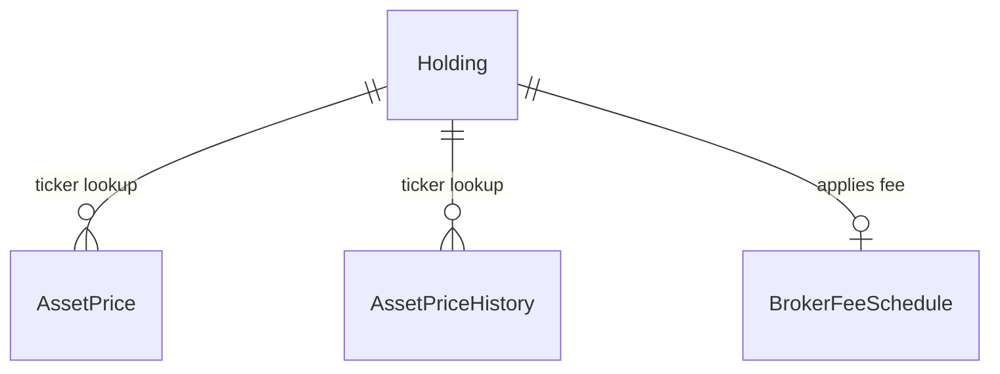

# ms-investments — domain

Aggregates, value objects, invariants and schema. Endpoints: `API.md`. Messaging: `EVENTS.md`.
Shared VOs (`Money`, `Cbu`, `BankNumber`, `UserId`): parent `.ai/references/APP_STRUCTURE.md`.

## Aggregates

| Aggregate | Root entity | Owned entities / VOs | Repository | Key invariant |
|---|---|---|---|---|
| Holding | `Holding` | `ThresholdConfig`, `NotificationTimestamps` | `HoldingRepository` | Keyed by `(userId, bankNumber, ticker)`; quantity > 0; avgPurchasePrice positive `Money` |
| FxRate | `FxRate` | — | `FxRateRepository` | Dated currency exchange rates for `MEP`, `CCL`, or `OFICIAL` views; unique per `(rateDate, fxView)` |
| MarketIndex | `MarketIndex` | — | `MarketIndexRepository` | Keyed by index code (`MERVAL`, `SP500`, `RIESGO_PAIS`); stores current value and variation |
| BrokerFeeSchedule | `BrokerFeeSchedule` | — | `BrokerFeeScheduleRepository` | Fee tiers by `(bankNumber, assetType)`; fee percentages strictly in `[0, 100]` |

## Entities & Read Models

| Entity / Read Model | Purpose | Key fields |
|---|---|---|
| `AssetPrice` | Current market price per ticker | `ticker`, `lastPrice`, `openPrice`, `highPrice`, `lowPrice`, `volume`, `dailyVariation` |
| `AssetPriceHistory` | Historical OHLC snapshot | `ticker`, `lastPrice`, `pricedAt`, filtered to omit zero-price pre-open candles |
| `MarketQuote` | Market discovery panel item | `symbol`, `lastPrice`, `dailyVariation` |
| `PortfolioSnapshot` | EOD portfolio valuation snapshot | `userId`, `snapshotDate`, `totalsByCurrency` (JSONB) |
| `RefreshJob` | Price refresh execution state | `status`, `startedAt`, `finishedAt` |

## Value objects

Service-local only — `Money`, `Cbu`, `BankNumber`, `UserId` documented once at parent.

| VO | What it wraps | Validation it enforces |
|---|---|---|
| `Ticker` | Ticker symbol string (e.g. `GGAL`, `AAPL`) | Trimmed uppercase string |
| `HoldingQuantity` | Positive asset quantity | `quantity > 0` |
| `ThresholdConfig` | `gainPct`, `lossPct` thresholds | Non-negative numeric percentage if present |
| `NotificationTimestamps` | `lastGainNotifiedAt`, `lastLossNotifiedAt` | Nullable timestamps, stamped on breach |

## Enumerations

| Enum | Values | What decides the value |
|---|---|---|
| `AssetType` | `STOCK`, `BOND`, `CEDEAR`, `FCI` | Set on holding creation; maps to IOL market (`FCI` → `fci`, others → `bCBA`) |
| `FxView` | `MEP`, `CCL`, `OFICIAL` | Selected on FX rate queries and conversions |
| `FxRateSource` | `IOL_SYNTHETIC`, `IOL_DIRECT`, `MANUAL` | Set based on rate calculation origin |
| `RefreshJobStatus` | `IN_PROGRESS`, `COMPLETED`, `FAILED` | Tracks scheduled price refresh run state |

## Domain services

| Service | The single decision it owns |
|---|---|
| `GetPortfolioSummaryUseCase` | Aggregates holdings with live asset prices to compute cost basis, current valuation, unrealised P&L, and allocation breakdown |
| `EvaluateThresholdsUseCase` | Evaluates P&L % against `ThresholdConfig` after price refreshes to flag breached gain/loss alerts |

## ERD

## Schema `investments`

| Migration | What it adds |
|---|---|
| V1 | `holdings` and `asset_prices` tables |
| V2 | `notify_*_threshold_pct` and `last_*_notified_at` columns on `holdings` |
| V3 | Performance indexes on `(user_id, ticker)` and threshold fields |
| V4 | OHLC columns on `asset_prices`; creates `asset_price_history` table |
| V5 | Legacy `bank_account_id` on `holdings` (superseded) |
| V6 | Legacy `bank_id` on `holdings` (superseded) |
| V7 | `portfolio_snapshots` table |
| V8 | `market_panel_quotes` table |
| V9 | `volume` and `currency` columns on `market_panel_quotes` |
| V10 | `refresh_jobs` table |
| V11 | `portfolio_snapshots.totals_by_currency` as JSONB |
| V12 | Replaces legacy bank IDs with `account_cbu` column |
| V13 | `outbox_event` table |
| V14 | Rekeys `holdings` to `bank_number` |
| V15 | `fx_rates` table |
| V16 | `market_indices` table |
| V17 | `broker_fee_schedules` table |
